<h1 align="center">Bug_Tracker</h1>
<h3 align="center" >Make The Kill List, Now!</h3>

## About
Bug tracker is an application for tracking error or bug in software. It is developed by [Rohan Bin Khokon](https://binrohan.github.io/me "My Protfolio") as a student project for job preparation in 2020. Bug Tracker uses a ticketing system to record bugs or other issues in the software development process on a per-project basis. It implements user- and role-level security to ensure only authorized users can access tickets and projects.

## Features
- Registration / Login
- Users roles
  - Admin
  - Manager
  - Developer
- Create project
- Create Tickets for a bug
- Comment post in ticket
- 3 steps approval of ticket
- Dashboard with basic information
- Approve new user
- Assign users to project
- Assign user to ticket
- Edit user information
- Edit / Approve Ticket or project
  
## Tech Stack
---
| Stack    | -                                                                                                  | -                                                                                                 | -                                                                                                | -                                                                                                                | -                                                                                                   |
| -------- | -------------------------------------------------------------------------------------------------- | ------------------------------------------------------------------------------------------------- | ------------------------------------------------------------------------------------------------ | ---------------------------------------------------------------------------------------------------------------- | --------------------------------------------------------------------------------------------------- |
| FrontEnd | <p align="center">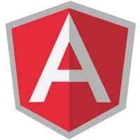 <br />Angular</p> | <p align="center"> <br />Typescript</p>  | <p align="center"> <br />Material</p>   | - |
| BackEnd  | <p align="center">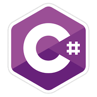 <br />C#</p>   | <p align="center"> <br />ASP.NET Core</p> | <p align="center">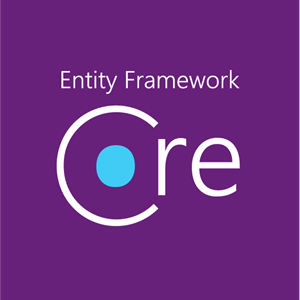 <br />Entity Framework</p> | <p align="center">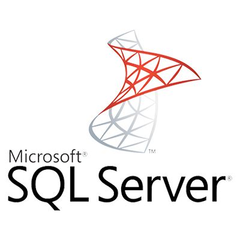 <br />SQL Server</p>               |

## Concept Map
<p align="center">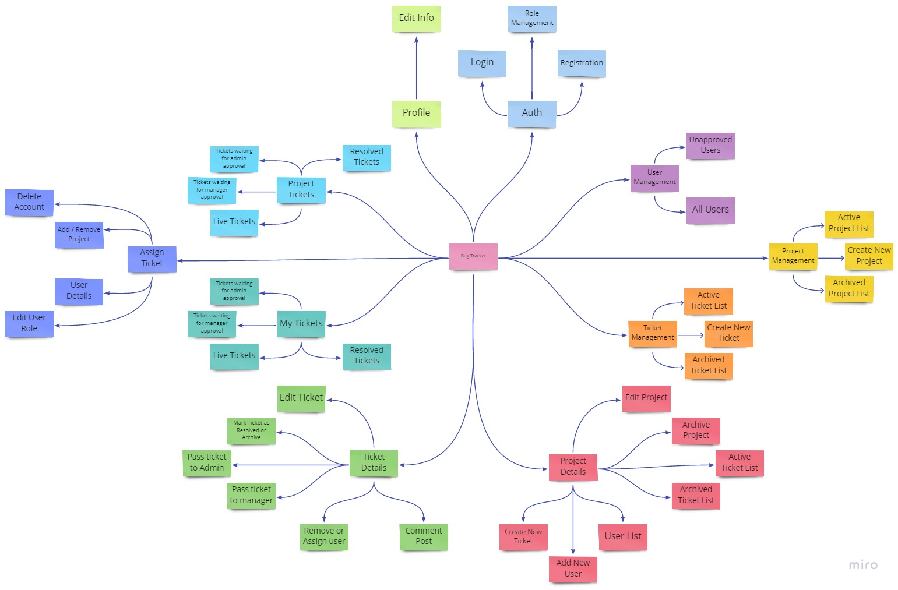 <br />Concept map</p>

## Database
<p align="center"> <br />entity relationship</p>

## Screenshots
### Registration Form
Angular reactive form for user registration.
<p align="center">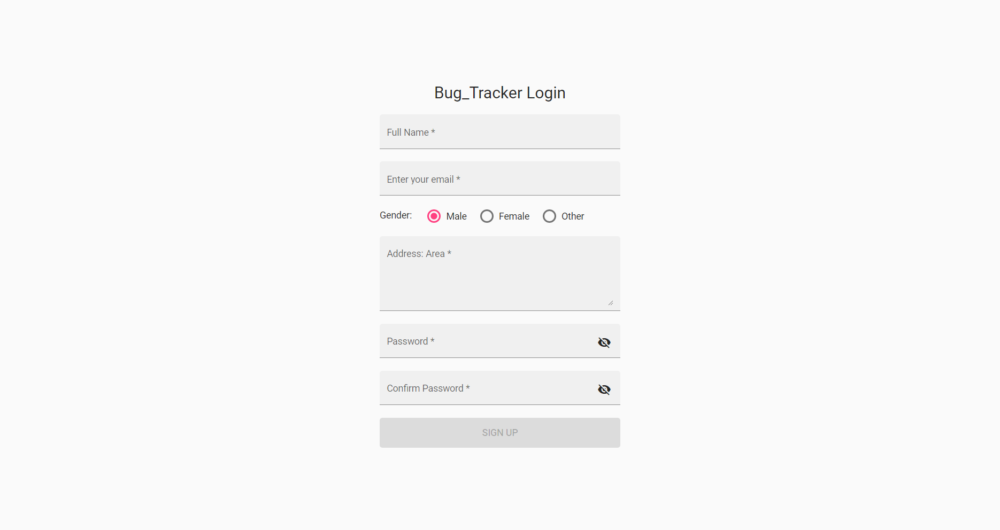 <br />Registraion form</p>

### Login Form
Template driven angular form for user login.
<p align="center">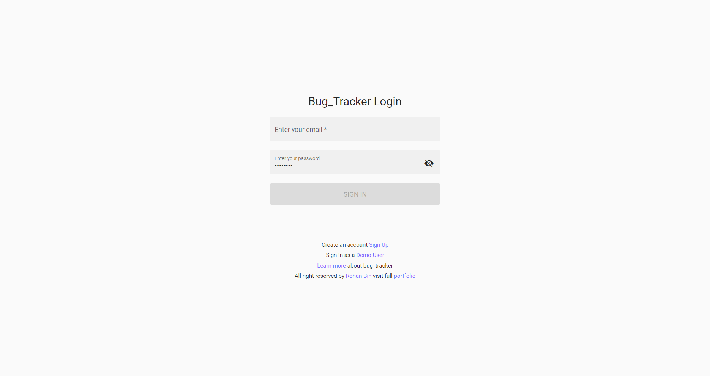 <br />Login Form</p>

### Dashboard
Dashboard contains some basic counting and stats and quick access system.
following picture of dashboard showing all availble option.
<p align="center">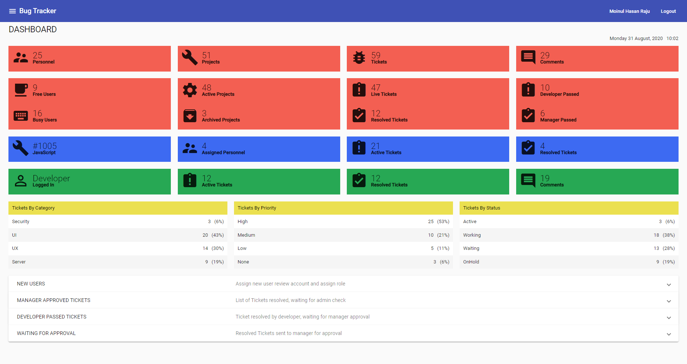 <br />Dashboard</p>

### App Drawer
A floating UI toggle hide by clicking a button on toolbar contains navigation thats helps easy navigation between different section of the Application.
<p align="center">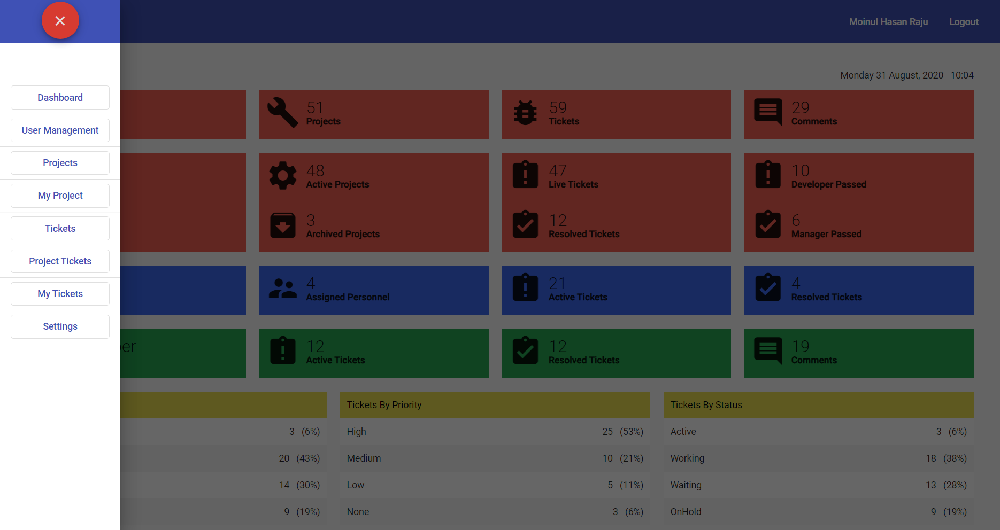 <br />Navigation</p>

#### User Case for Navigation buttons
<p align="center"> <br />Use case diagram</p>

### User Profile
<b>Shows</b> and <b>Edit</b> information of logged in user.
<p align="center"> <br />User profile</p>

### User Details
<b>Displays</b>  the detail information of user when user visit others' profile
<p align="center">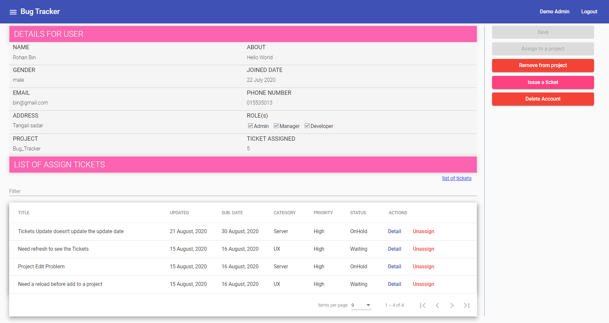 <br />User profile</p>

### Management UI
Project management, ticket management all of them have same kinds of user interface.
<p align="center">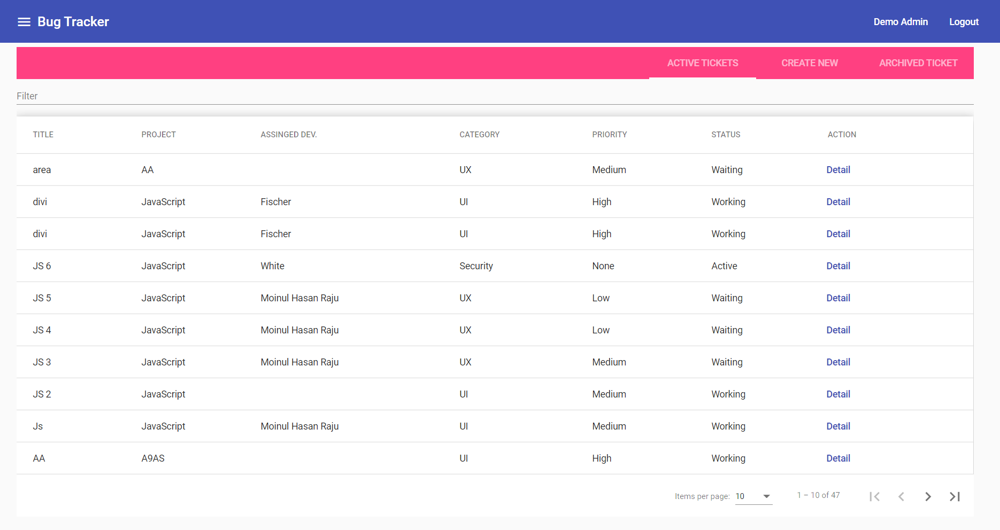 <br />User details</p>

### User Management
Shows the list of all users and new registered users whose role aren't assigned yet.
<p align="center">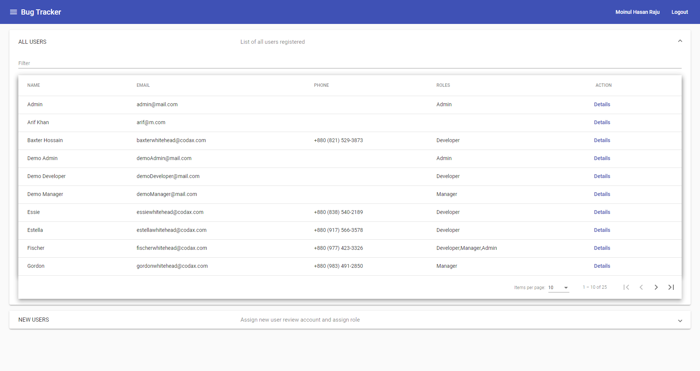 <br />User management</p>

### Project Details
View all detail information based on user roles
<p align="center">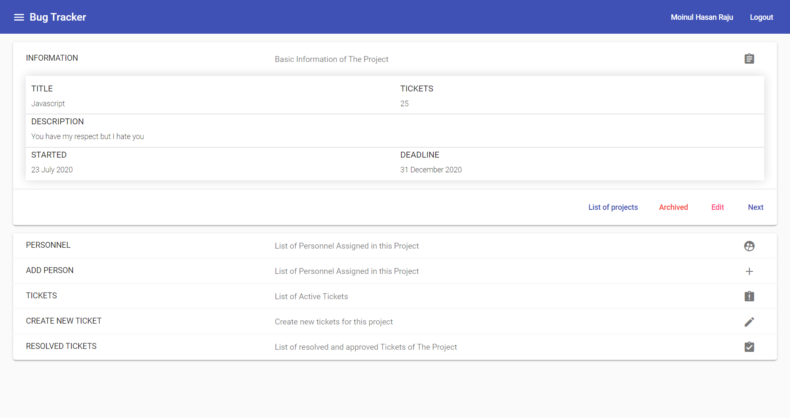 <br />Project details</p>

### Ticket Details
This view shows detail information of a ticket
<p align="center">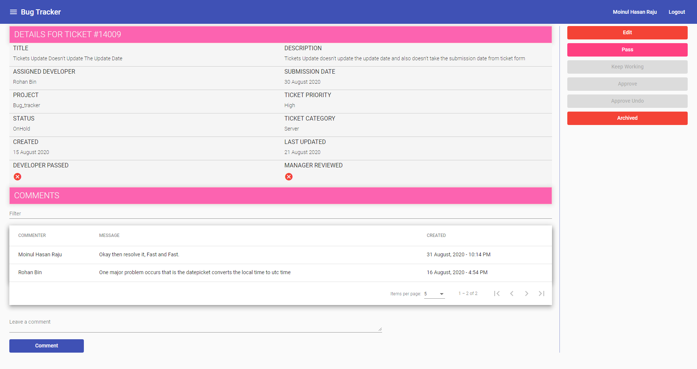 <br />Ticket details</p>

### Create New Ticket
A form to create a new ticket. It is an angular reactive form.
<p align="center">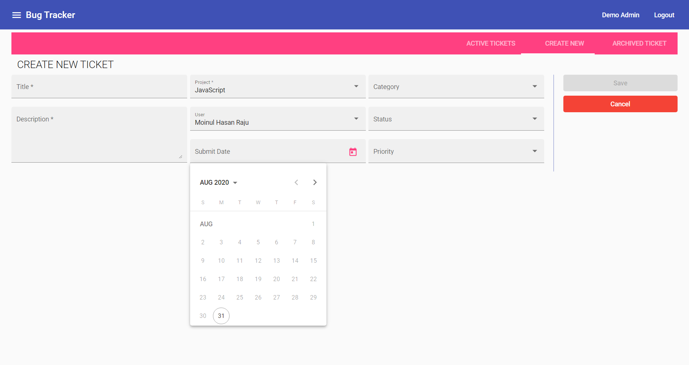 <br />Ticket form</p>

## Installation
Run the application locally
### Step 1: Clone The Repo
Fork the repository. then clone the repo locally by doing
```sh
git clone https://github.com/anuraghazra/BugVilla.git
```
### Step 2: Install Dependencies
cd into the cloned repo
Fist going for API
```cmd
cd BugTracker.API
dotnet restore
dotnet run
```
Then SPA
```cmd
cd ..
cd BugTracker-SPA
npm install
ng serve
```
Done!

You can login for first time using:
- Email: admin@mail.com
- Password: password
  
## Reporting bugs
You found a bug? Please report it to me binrohan.cs@gmail.com. Thank you!

## Contact
- Phone: +880 1553501368
- Email: binrohan.cs@gmail.com
- Website: [binRohan](https://binrohan.github.io/me/)


